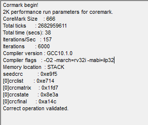
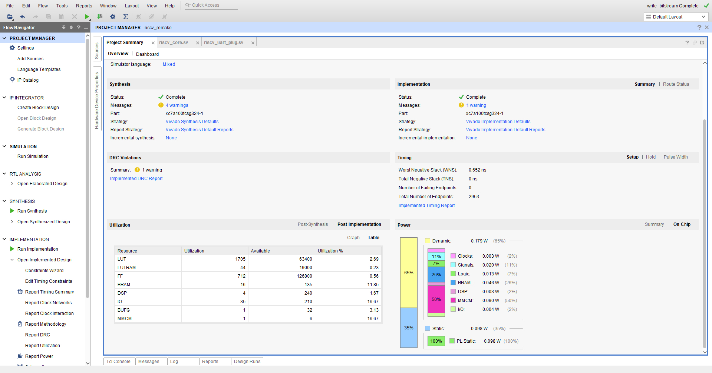

# RISC-V RV32IM CORE

## Features

1.  I and M extension support
2.  On-chip instructions/data RAM
3.  2-stage pipeline
4.  Divider: 32 clock ticks
5.  Multiplier: 5 clock ticks for 32x32 operations and 3 clock ticks multiplier for 18x18 operations
6.  Sindle thread
7.  Single-level interrupts

## Perfomance

Target board: Nexys A7-100T
Target FPGA: xc7a100tcsg324-1

---

1. Coremark:        157
2. Max. freq.:      70 MHz
3. Coremark/Mhz:    2.24

---

 

Coremark results
  

---

 

Vivado implementation results
  